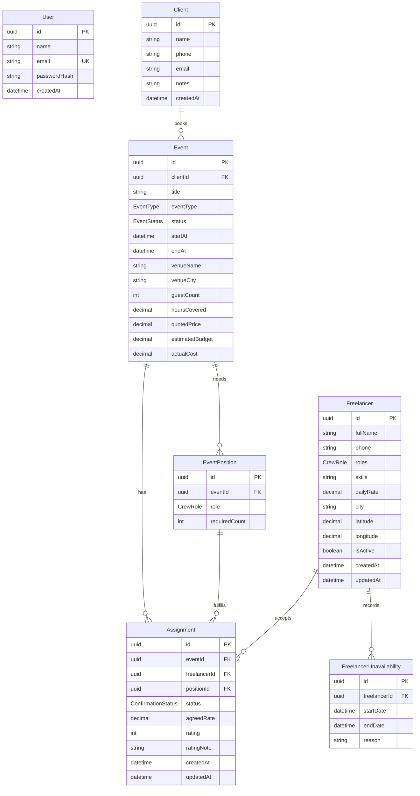

# CrewMatch Phase 1 ERD

```mermaid
erDiagram
  User {
    uuid id PK
    string name
    string email UK
    string passwordHash
    datetime createdAt
  }
  Client {
    uuid id PK
    string name
    string phone
    string email
    string notes
    datetime createdAt
  }
  Freelancer {
    uuid id PK
    string fullName
    string phone
    CrewRole roles
    string skills
    decimal dailyRate
    string city
    decimal latitude
    decimal longitude
    boolean isActive
    datetime createdAt
    datetime updatedAt
  }
  FreelancerUnavailability {
    uuid id PK
    uuid freelancerId FK
    datetime startDate
    datetime endDate
    string reason
  }
  Event {
    uuid id PK
    uuid clientId FK
    string title
    EventType eventType
    EventStatus status
    datetime startAt
    datetime endAt
    string venueName
    string venueCity
    int guestCount
    decimal hoursCovered
    decimal quotedPrice
    decimal estimatedBudget
    decimal actualCost
  }
  EventPosition {
    uuid id PK
    uuid eventId FK
    CrewRole role
    int requiredCount
  }
  Assignment {
    uuid id PK
    uuid eventId FK
    uuid freelancerId FK
    uuid positionId FK
    ConfirmationStatus status
    decimal agreedRate
    int rating
    string ratingNote
    datetime createdAt
    datetime updatedAt
  }
  Client ||--o{ Event : books
  Event ||--o{ EventPosition : needs
  Event ||--o{ Assignment : has
  EventPosition ||--o{ Assignment : fulfills
  Freelancer ||--o{ Assignment : accepts
  Freelancer ||--o{ FreelancerUnavailability : records
```
